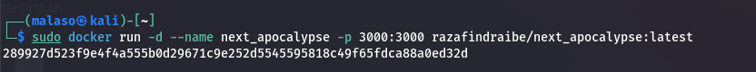

# CTF Writeup: Next Apocalypse

## Challenge Description

**Background:**
MediClinic, a cutting-edge hospital, has just finished deploying its new internal staff portal. Before going live, the security team wants to ensure that the website is truly secure and ready for real-world use.

**Your Mission:**
You’ve been hired as a penetration tester to evaluate the security of the MediClinic portal. To prove your assessment, the developers have hidden a secret flag somewhere in the application. Finding this flag will serve as your Proof of Concept (PoC) and validate your penetration test, which is required for your final payment.

<pre>**Note:** This is a black box penetration testing so, good luck !</pre>

----------------------------------------------------------------------
## Download the docker image.
- The docker images is available on my docker hub.
<pre>Link : https://hub.docker.com/repositories/razafindraibe</pre>

<pre>sudo docker pull razafindraibe/next_apocalypse:latest</pre>

- Run the container:
<pre>sudo docker run -d --name next_apocalypse -p 3000:3000 razafindraibe/next_apocalypse:latest</pre>

## Step 1 : Reconnaissance
----------------------------------------------------
**1 - Check your container’s IP address**

<pre>docker inspect -f '{{range .NetworkSettings.Networks}}{{.IPAddress}}{{end}}' ID DU CONTENEUR </pre>

So, if you forgot your container’s ID, run:

<pre>docker ps</pre>

Here, I have **172.12.0.2**,which is the IP address of our target.

-------------------------------------------------------------------

**2 - Let’s start with a simple IP scan using :** nmap

Here, i only have on port : **3000**

---------------------------------------------------------------------

**3- Let's access the site :**

So, here we are in the authentication page.
- I tried to access the admin page but it requires a login , ofcourse.
- I search for hints in the source code but, nothing:

**4- Let’s continue our exploration with *gobuster***

Hummmmm.... weird !!! i can only see /login and /admin.

But, on the footer page, i found the framework that was used

<pre>Next js 15.3.8</pre>

Maybe, it's a hint...

------------------------------------------------------------------
## Step 2 :Exploitation

**1 - I asked chatGPT for the recent version of JS**

Ahhh okey ! but we have the *13.5.8 version.*

**2 - Search for possible exploit**

Bingo !!! **CVE-2025-29927**

What is this **CVE-2025-29927** ?
-   **Description**:
    CVE-2025-29927 is a critical vulnerability affecting Next.js versions 11.1.4 between 12.3.5, 13.0.0 to 13.5.8, 14.0.1 through 14.2.24, and 15.0.1 through 15.2.2.

    If successfully exploited, this vulnerability allows a threat actor to bypass authorization checks within a Next.js application, that is if the authorization check occurs in middleware. A technical analysis published by JFrog demonstrates how a malicious actor could exploit this weakness by sending a specially crafted HTTP request with the x-middleware-subrequest header to bypass the authorization check and access protected resources.

-   **CVSS**: 9.1(critical)
-   **Resume** : It is possible to bypass authorization checks within a   Next.js application if those checks occur in middleware. 

**Links:**
-   Exploit : https://projectdiscovery.io/blog/nextjs-middleware-authorization-bypass

**3- Exploit the vulnerability**

I tried to **curl** the page but, I was redirected :

I use the payload : 

<pre>curl -s http://localhost:3000/admin -H "x-middleware-subrequest: middleware:middleware:middleware:middleware:middleware"</pre>

Result:

Booommmm !!!! I accessed the admin page without authentication because of the middleware vulnerability.

-------------------------------------------------------
FLAG:
<pre>CTF{next_middleware_should_not_be_your_only_guard}</pre>